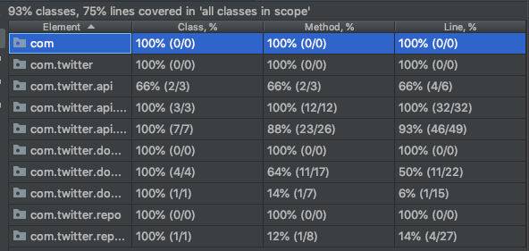

# Clever API for Twitter Service (CATS)

## Description

Build a simple social networking application, similar to Twitter, and expose it through a web API. The application should support the scenarios below.

### Scenarios

#### Posting
A user should be able to post a 140 character message.

#### Wall
A user should be able to see a list of the messages they've posted, in reverse chronological order.

#### Following
A user should be able to follow another user. Following doesn't have to be reciprocal: Alice can follow Bob without Bob having to follow Alice.

#### Timeline
A user should be able to see a list of the messages posted by all the people they follow, in reverse chronological order.

## Prerequisites and Solution

- [x] Code: Java 8, Spring Boot, Spring Web Framework, Gradle
- [x] In memory storage
- [x] Application splitted into 3 sub apps 
- [x] Functional tests: Spock, Groovy, Spring Mock MVC
- [x] Application architecture - MVC & [Ports-And-Adapters](https://spin.atomicobject.com/2013/02/23/ports-adapters-software-architecture/)
- [x] Solution time: 2 days - most of the time I spent on writing tests
- [x] Added Actuator - just for fun
- [x] Deploy application on [AWS](http://cats.eu-west-1.elasticbeanstalk.com/actuator/mappings) - use this address in POSTMAN for proper POST request handling

## Running application locally

- use gradle: ./gradlew bootJar
- java -jar twitter-rest-api/build/libs/cats-0.1.2.jar

#### Load postman collection from postman_collection folder

#### Requests examples ready to play with on localhost, port 8080

- http://localhost:8080/create_post/username1
- http://localhost:8080/create_post/username2
- http://localhost:8080/follow/username1/username2
- http://localhost:8080/wall/username1
- http://localhost:8080/timeline/username1

Actuator - mappings:
- http://localhost:8080/actuator/mappings

#### Test coverage report

